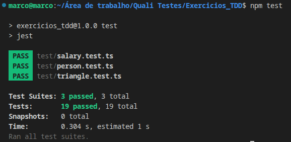
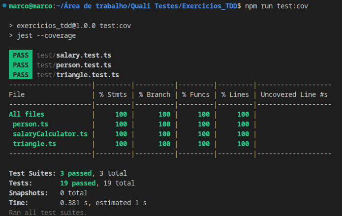

# Exercícios TDD

Implementação de três exercícios práticos seguindo a técnica de **TDD (Test Driven Development)**, desenvolvidos em **TypeScript** e **Jest**

## 📋 Pré-requisitos

Para rodar este projeto, você precisará ter instalado em sua máquina:
* [Node.js](https://nodejs.org/) (v16 ou superior recomendada)
* [npm](https://www.npmjs.com/) (instalado junto com o Node)

## 🛠️ Procedimentos de Build

Siga os passos abaixo para configurar o ambiente e preparar o projeto:

1. **Para executar os testes:**
   ```bash
   npm test

---

## 🧪 Execução de Testes

1. **Rodar os testes:**
   ```bash
   npm run test

2. **Gerar relatório de coverage:**
   No terminal, dentro da pasta do projeto, execute:
   ```bash
   npm run test:cov

---

## 📖 Evidências

npm run test



npm run test:cov



